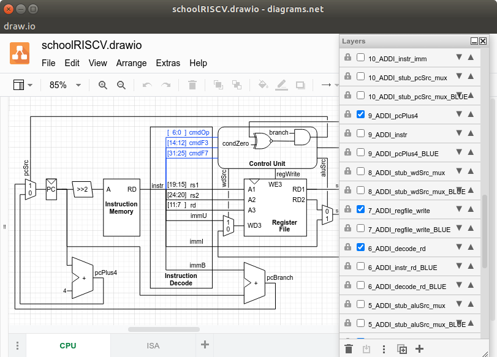
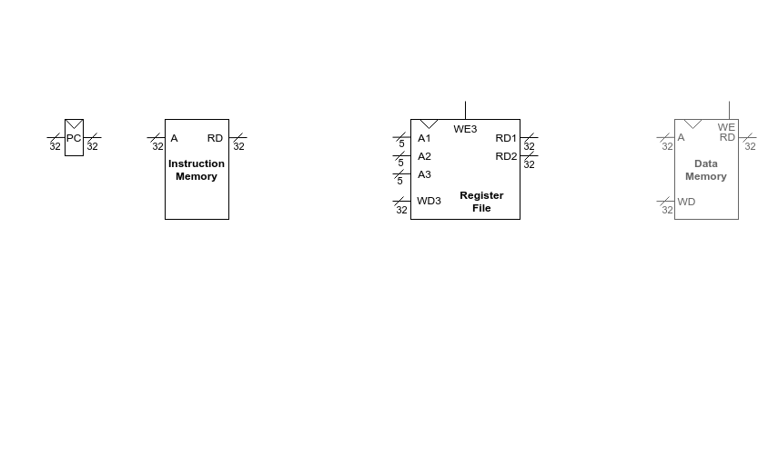

# drawio-layer
Layer management script for draw.io
Allows to list/show/hide layers on diagram page

## Usage

```
$ ./drawio-layer.py -h
usage: drawio-layer.py [-h] [-l] [-lv] [-lh] [-V] [-p PAGE_INDEX]
                       [-n NAME [NAME ...]]
                       [-t {idle,show,hide,show_only,hide_only}]
                       file

Layer management script for github.com/jgraph/drawio

positional arguments:
  file                  file name

optional arguments:
  -h, --help            show this help message and exit
  -l, --list            list layers (default: False)
  -lv, --list-visible   list visible layers (default: False)
  -lh, --list-hidden    list hidden layers (default: False)
  -V, --verbose         verbose mode (default: False)
  -p PAGE_INDEX, --page-index PAGE_INDEX
                        selects a specific page (default: 0)
  -n NAME [NAME ...], --name NAME [NAME ...]
                        layer names (default: [])
  -t {idle,show,hide,show_only,hide_only}, --action-type {idle,show,hide,show_only,hide_only}
                        Action Type. Allowed values are: idle, show, hide,
                        show_only, hide_only (default: idle)
```

## Examples

Export schoolRISCV.drawio to unpacked temp.xml
```
$ drawio --export --uncompressed --output temp.xml schoolRISCV.drawio
```

List layers from page-index 0
```
$ ./drawio-layer.py --list --page-index 0 temp.xml 
0_border_wide
0_cpuState
0_DataMemory
1_ADDI_addr_shift_BLUE
1_ADDI_addr_shift
...
```

List layers from page-index 0 with visibility information:
```
$ ./drawio-layer.py --list --verbose --page-index 0 temp.xml 
0_border_wide                   True
0_cpuState                      True
0_DataMemory                    False
1_ADDI_addr_shift_BLUE          False
1_ADDI_addr_shift               True
...
```

Hide all the layers from page-index 0 except 0_border_wide 0_cpuState 0_DataMemory
```
drawio-layer.py temp.xml --page-index 0 --action-type show_only --name 0_border_wide 0_cpuState 0_DataMemory
```

Export page-index 0 to 00.png
```
drawio --export --page-index 0 temp.xml --output 00.png
```

## Output Example

A simple layer management script like [example/Makefile](example/Makefile) can be used to convert [example/schoolRISCV.drawio](example/schoolRISCV.drawio) to a .gif.

### Input



### Output


